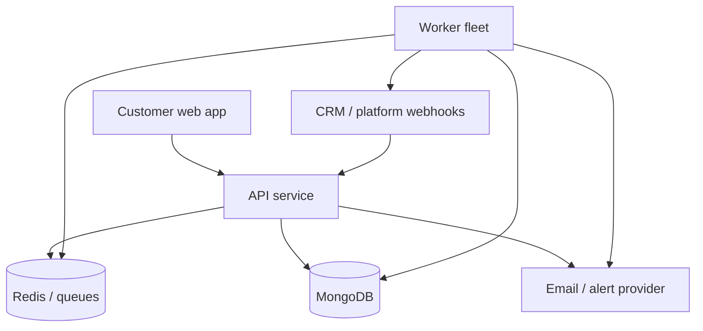
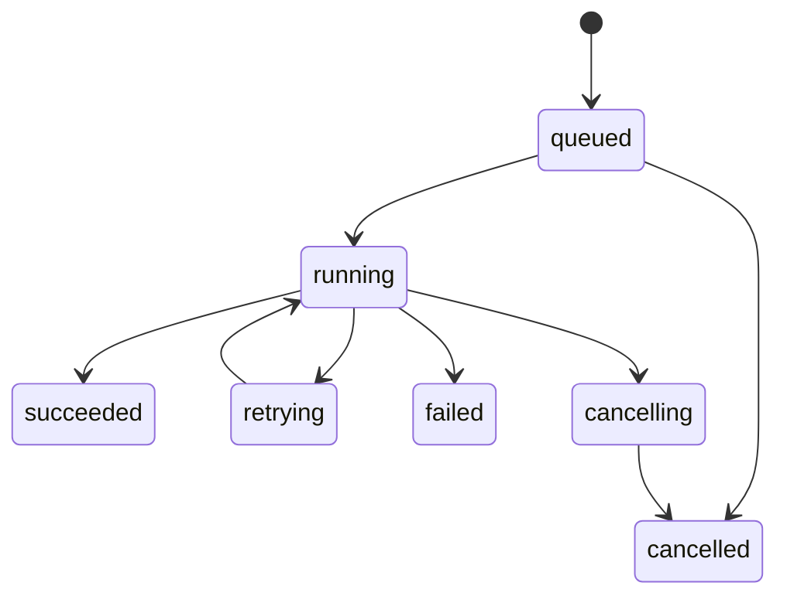

# Architecture

## Runtime topology

The API owns authentication, validation, authorization, request idempotency, and enqueueing. Workers own bounded execution, provider rate limits, retries, checkpoints, and terminal result accounting. MongoDB is the system of record; Redis is coordination infrastructure and is never the only copy of a durable job or audit outcome.

## Tenant and authorization boundary

The canonical tenant key is `organizationId`. Authentication resolves the active organisation from a revocable server-side session and an active membership. Business routers receive `req.auth.organizationId`; repositories require it as an explicit argument; queue payloads persist it; workers revalidate ownership when loading every referenced object.

Collections use an organisation field and compound indexes such as `{ organizationId, _id }` or `{ organizationId, externalId }`. Unique constraints that are tenant-local include `organizationId`. Global lookups are limited to authentication/bootstrap records and owner-only platform operations. Cross-organisation aggregation is an explicit platform-admin capability and is audit logged.

Roles are intentionally small and composable:

| Role | Intended authority |
|---|---|
| Owner | Organisation lifecycle, billing, members, connections, and all workloads |
| Admin | Members, connections, settings, and workloads; no ownership transfer |
| Operator | Create and operate workflows, batches, schedules, exports, and monitors |
| Viewer | Read-only access to permitted organisation views |
| Billing | Read billing, usage, and reports; manage the customer billing portal |

## Execution safety

Workflow definitions are versioned structured data. Publication validates node types, schemas, graph connectivity, cycle/step limits, declared capabilities, and secret references. Execution is pinned to an immutable version.

The engine supports bounded transforms and condition evaluation. It does not call JavaScript `eval`, `Function`, a shell, arbitrary modules, or raw customer-supplied HTTP nodes. Templating rejects prototype traversal and has output-size limits. Outbound webhook actions can reference only a tenant-owned, pre-verified exact Destination; execution applies DNS pinning/private-network protection, redirect denial, request timeouts, response-size limits, encrypted headers, and secret redaction.

Each execution has a state machine:

Retries apply only to classified transient failures and use exponential backoff with jitter. Side effects use deterministic idempotency keys. Maximum attempts, wall time, node count, payload size, and output size are bounded.

## Batch safety

Every mutating batch is created in preview mode. Preflight resolves the target set, action count, estimated provider calls/cost exposure, warnings, and a stable plan digest. Execution requires a short-lived confirmation tied to that digest; changing the query or actions invalidates confirmation. The durable job stores checkpoints, per-record results, counters, and exported failures. Pause, resume, cancel, and retry are state transitions, not best-effort UI flags.

## Connector boundary

Platform-specific logic stays behind adapter interfaces: capabilities, authorization, token refresh, webhook verification, pagination, rate feedback, object mapping, and provider error classification. The engine consumes neutral commands and never reaches into provider credential documents directly.

Encrypted connection records are scoped to one organisation. Decrypted material exists only in the process handling a request/job and is not cached in shared application documents. Automatic refresh is serialized per connection to prevent refresh-token races.

## Reliability

- Durable jobs are stored before enqueueing.
- Workers are safe to restart and resume from checkpoints.
- Scheduled work uses a distributed ownership/lease strategy.
- Inbound events and outbound mutations are idempotent.
- Readiness fails when required dependencies are unavailable; liveness remains a process check.
- Structured logs carry request, organisation, job, and execution correlation identifiers but redact payload secrets.
- Audit events are append-only through application APIs.
